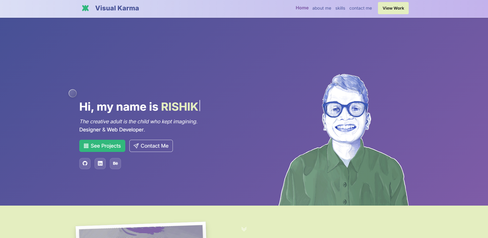

# Visual Karma – Personal Portfolio  
*The creative adult is the child who kept imagining.
Designer & Web Developer.* ✨  

Welcome to **Visual Karma**, my personal portfolio website.  
It’s a space where I bring together my skills as a **Designer & Web Developer** with a focus on creativity, interaction, and storytelling.  

  
  

## 🔮 About  
This portfolio is designed to be **minimal, modern, and interactive**, with smooth **GSAP animations** and thoughtful layouts that make browsing enjoyable.  
It showcases my work in:  
- 🎨 Art & Design  
- 🏷 Brand Identity  
- 💻 UI/UX & Web Development  

## ✨ Features  
- Clean and minimal user interface  
- Smooth animations powered by **GSAP**  
- Fully responsive layout across devices  
- Project showcase with categories  
- Easy navigation with a modern look  

## 🛠️ Built With  
- **HTML5** / **CSS3**  
- **JavaScript (ES6+)**  
- **GSAP (GreenSock Animation Platform)**  
- **Cursor.io** (AI)  
- Deployed on **GitHub Pages**  
